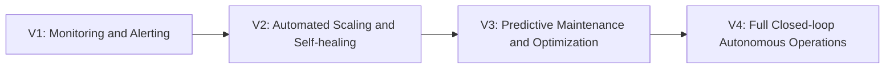

# Operational Excellence Story Ideas (for a Software Application)

## 1. The Self-Healing System
The app detects performance degradation before users notice, automatically routes traffic to healthier services, and flags a human only when necessary — minimizing downtime and maintaining service excellence.

## 2. One Source of Truth
Different teams were maintaining different data manually, causing constant misalignment. The app centralizes operational metrics, inventory, and workflows into a **single, live dashboard**, eliminating version-control nightmares.

## 3. The Invisible Update
The dev team learns to ship updates using canary deployments and feature flags inside the app — drastically reducing risks, speeding up releases, and giving ops teams the confidence to move fast without fear.

## 4. Built-in Compliance
Instead of forcing people to remember endless policies, the app naturally enforces compliance rules **in the flow of work** (e.g., data retention, approval workflows) — making operational excellence effortless.

## 5. Feedback Loop Magic
The app has a tiny but powerful feedback widget that captures friction points instantly. Over time, it feeds analytics showing which workflows cause confusion, driving iterative ops improvements without formal surveys.

## 6. The Disaster Recovery Rehearsal
The ops team uses the app to run simulated outage events (like Chaos Engineering) automatically — finding gaps in their response plans and achieving real operational excellence *before* the real-world tests hit.

## 7. The No-Touch Audit
Normally audits are painful, but this app automatically logs operational activities, approvals, and incident responses in an immutable ledger — so audits become painless, transparent, and real-time.

## 8. Performance by Design
The app is architected from day one for low-latency and high-availability — not bolted on later. The story shows how design thinking around ops needs leads to excellence users can *feel* (fast load times, minimal errors).

## 9. The Modular Miracle
The app is built in modular services, allowing different teams to operate independently (DevOps, SREs, Security), reducing bottlenecks and making operational improvements locally without breaking the whole system.

## 10. Operational Metrics at the Core
Instead of burying ops metrics in admin consoles, the app surfaces them *directly* into user dashboards where relevant — leading to a culture where teams naturally notice, care about, and improve operational KPIs.

## 11. Auto-Scaling Savior
During a sudden user spike (maybe Black Friday, a viral tweet), the app's backend auto-scales perfectly based on load, keeping everything smooth — demonstrating how infrastructure ops excellence protects business outcomes.

## 12. Continuous Delivery Champion
The team sets up full CI/CD pipelines where unit tests, integration tests, load tests, and security scans all run automatically — meaning operations are no longer a bottleneck to innovation, but an enabler.

## 13. The Great Migration
The story of migrating an old monolithic app into cloud-native microservices — not for "buzzwords," but because doing so unlocked reliability, faster updates, and much more resilient operational practices.

## 14. The App That Trained Itself
Through embedded AI/ML, the app notices patterns of failures, resource wastage, or bottlenecks — and **recommends** optimizations automatically, like resizing cloud instances or suggesting code improvements.

## 15. Built for the Operator
The app includes an "operator view" where internal ops staff can see exactly what the customer sees plus operational metadata — so diagnosing and fixing issues becomes lightning fast.

---

# Optional Next Step

🔵 **Roadmap idea for growing operational excellence in the app:**

